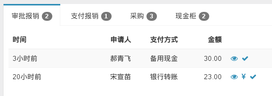

# 首页待办 Todo Tabs

```php
echo drodata\adminlte\TodoTabs::widget([
    'configs' => [
        [
            'unaudit-expense', '审批报销', '/cost/_grid-lite', ['type' => 'expense'],
            Cost::find()->unaudit()->expense()->orderBy('id DESC'),
            Yii::$app->user->can('accountant') && !Yii::$app->user->can('cashier'),
        ],
        [
            'pay-non-cash-expense', '支付报销', '/cost/_grid-lite', ['type' => 'expense'],
            Cost::find()->audited()->nonCash()->expense()->orderBy('id DESC'),
            Yii::$app->user->can('accountant') && !Yii::$app->user->can('cashier'),
        ],
        [
            'pay-expense', '报销', '/cost/_grid-lite', ['type' => 'expense'],
            Cost::find()->audited()->expense()->orderBy('id DESC'),
            Yii::$app->user->can('cashier'),
        ],
    ],
]);
```


