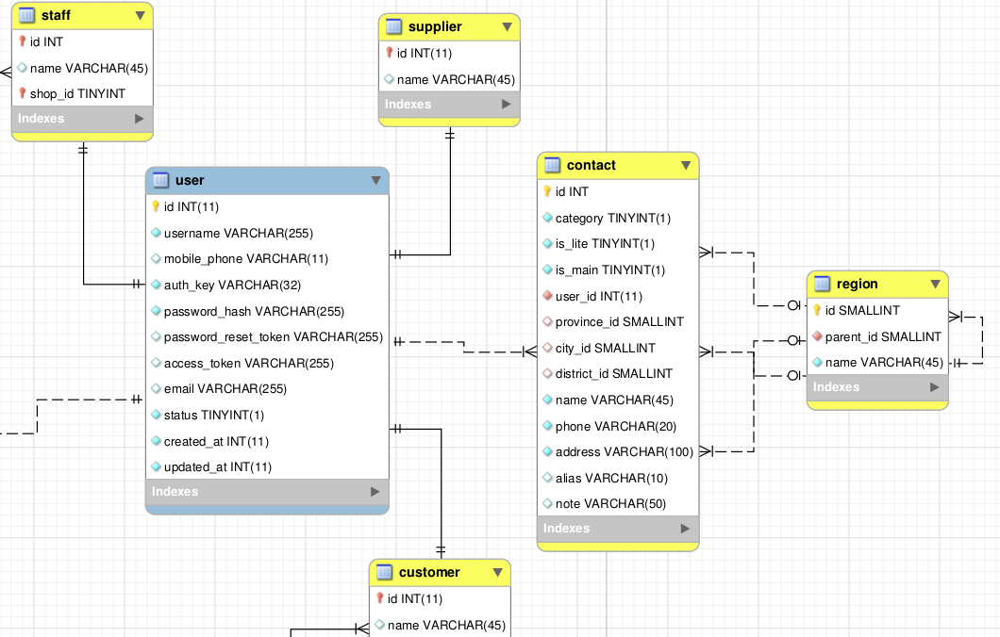

# 通用地址功能模块

联系方式是一个很常见的数据模型，主要存储姓名、电话、地址等，联系方式通常是基于人的，例如客户的联系地址。

我习惯将所有关于”用户“的具体模型都建立在 `user` 表基础上，与其共享主键。例如下图中的员工、供应商和客户表：



再将联系方式抽象成 `contact` 模型，关联到 user 表上，就构成了一个相对松散但联系紧密的功能模块。

## Schema

主要包含 `contact` 和 `region` 两个表，其中后者存储中国的区域信息。`contact` 结构具体如下：

Field | Type | Null | Key | Desc
------|------|------|-----|-----
id | BIGINT | NO | PRI |
category | TINYINT(1) | NO | | 类别，如 'customer', 'supplier' 等
is_lite | TINYINT(1) | NO | | 精简类型。精简地址不使用 region 存储省市区信息，全部存储在 `address` 内
is_main | TINYINT(1) | NO | | 主地址。设想是可以将某个地址设置成主地址。（**感觉不是特别必要**）
user_id | INT | YES | | 用户外键
province_id | SMALLINT() | YES | | `region` 表外键 
city_id | SMALLINT() | YES | | 同上
district_id | SMALLINT() | YES | |同上 
name | VARCHAR | NO | | 联系人姓名
phone | VARCHAR | NO | | 手机号码
address | VARCHAR | NO | | 地址。`is_lite` 为 0 时仅存储街道信息
alias | VARCHAR | YES | | 地址别称，用关键字标记地址，例如”家“、”公司“等，灵感来自京东
note | VARCHAR | YES | | 备注

说明：

- 若 `user_id` 为空，可以通过将 `category` 设置成不同的值存储一些特殊的地址；

## 模型文件

`drodata\models\Contact`. 具体到应用中，需要单独创建一个子类，例如 `backend\models\Contact`:

```php
namespace backend\models;

class Contact extends \drodata\models\Contact
{
    const CATEGORY_CUSTOMER = 1;

    /**
     * @return \yii\db\ActiveQuery
     */
    public function getCustomer()
    {
        return $this->hasOne(Customer::className(), ['id' => 'user_id']);
    }
    public function getStaff()
    {
        return $this->hasOne(Staff::className(), ['id' => 'user_id']);
    }

    /**
     * 通用新建修改操作视图中的参数
     * @return array indexed
     */
    public function getViewParams()
    {
        switch ($this->category) {
            case self::CATEGORY_CUSTOMER:
                return [
                    '客户联系方式', //label
                    "{$this->customer->name}", //subtitle
                    '/customer', //redirectRoute
                ];
                break;
        }
    }
}
```


## 视图文件

联系方式的新建表单、某个用户下所有联系方式的 list view 等。详见 `views/contact` 目录。
