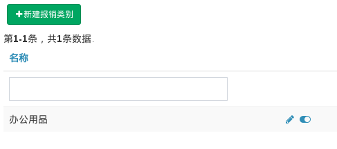

# Lookup

此表用来存储字典，建立数据库中的值与显示给用户的值之间的映射。

Field | Type | Null | Key | Desc
------|------|------|-----|-----
id | INT | NO | PRI |
type | VARCHAR(90) | NO | | 约定使用 'aa-bb' 格式
name | VARCHAR(50) | NO | | 显示给用户的值
code | TINYINT | NO | | 实际存储的数值
path | VARCHAR(50) | NO | | hashed 相对路径
position | TINYINT | NO | | 供排序使用，默认与 code 值相同
visible | TINYINT | NO | |

Lookup 表内存储的内容主要分两类：一种的值跟代码相关，不允许用户自定义，例如订单的状态；另一类允许用户自定义，例如报销时的分类。前者的值通过在对应模型中定义常量操作，后者的特点是仅使用 `lookup.name` 字段。后者需要一个页面来完成简单的管理操作。这类操作主要包括：新增、修改、隐藏或显示。

假设我们的应用是一个报销系统，员工在新建报销时需要选择报销类别，这个类别只有财务有管理权限。这个报销类别就很适合存储在 Lookup 内，假设报销类别的 `lookup.type` 值为 `expense-type`, 下面演示一下配置过程：

```php
// in application configuration

return [
    // ...
    'controllerMap' => [
        'expense-type' => [
            'class' => 'drodata\controllers\LookupController',
            'name' => '报销类别',
            'as access' => [
                'class' => 'yii\filters\AccessControl',
                'rules' => [
                    [
                        'allow' => true,
                        'roles' => ['accountant'], // 'accountant' 是财务的角色名
                    ],
                ],
            ],
            'as verbs' => [
                'class' => 'yii\filters\VerbFilter',
                'actions' => [
                    'delete' => ['POST'],
                ],
            ],
        ],
    ],
];
```

通过上面的配置，被赋予 `accountant` 的用户访问 `expense-type/index` 即可进行报销类别的管理。效果图如下：



## Modal Create

在搜集用户数据时，字典模型通常都是以下拉菜单的形式存在。当用户找不到合适的选项时，如果能通过 AJAX 快速创建一个选项，体验会好很多。

配置过程分为两步，下面我们仍以上面的报销类别管理为例简单演示一下：

### 第一步：注册 `GenericModelAsset`

我们设定了一个特殊的类名 `.model-create-lookup`, 含有此类名的按钮在点击时将触发 Modal create 动作，这段 JS 代码在 `drodata\assets\GenericModelAsset` 内定义，因此，我们可以在全局范围内注册此 asset:

```php
class AppAsset extends AssetBundle
{
    // ...
    public $depends = [
        // ...
        'drodata\assets\GenericModelAsset',
    ];
}
```

### 第二步：生成触发按钮

Select2 widget 可以很好地完成：

```xml
<?= $form->field($model, 'type')->widget(Select2::classname(), [
    'data' => Lookup::items('expense-type'),
    'options' => ['placeholder' => '请选择'],
    'addon' => [
        'append' => [
            'content' => Html::button(Html::icon('plus'), [
                'class' => 'btn btn-primary modal-create-lookup', 
                'data' => [
                    'type' => 'expense-type',
                ],
            ]),
            'asButton' => true
        ]
    ],
]) ?>
```
可以看到我们为按钮添加了 `.modal-create-lookup` 类，还有一个必须且重要的属性 `data-type`, 它的值与 `lookup.type` 值相同，表示新建的是哪个类别下的字典记录。
