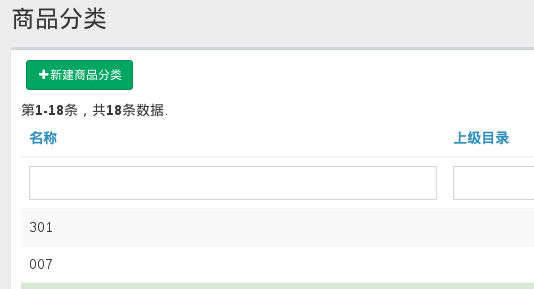

# 分类 Taxonomy

'taxonomy', 意思是分类学, 用来存储各种较复杂的分类名称。'taxonomy' 一词借鉴自 WordPress 表格结构。

Field | Type | Null | Key | Desc
------|------|------|-----|-----
id | BIGINT | NO | PRI |
type | VARCHAR(50) | NO | | 约定使用 'aa-bb' 格式
name | VARCHAR(50) | NO | |
slug | VARCHAR(50) | YES | | 用于生成易读的 url 
parent_id | BIGINT | YES | MUL |
visible | TINYINT | NO | |

## Quick Start

### Installtion

在应用内执行 `./yii migrate --migrationPath=@drodata/migrations` 安装基础表格。

### Configuration

假设我需要存储支持层级的产品分类信息，在应用配置文件中增加以下代码即可：

```php
return [
    // ...
    'controllerMap' => [
        'spu-category' => [
            'class' => 'drodata\controllers\TaxonomyController',
            'name' => '商品分类',
            // 以下两个行为可选，用于权限控制
            'as access' => [
                'class' => 'yii\filters\AccessControl',
                'rules' => [
                    [
                        'allow' => true,
                        'roles' => ['@'],
                    ],
                ],
            ],
        ],
    ],
];
```
之后访问 `/spu-category` 即可实现 CRUD.

`drodata\models\Lookup::taxonomies()` 可以快速生成指定类别的列表，用于生成下拉菜单。



## Modal Create in Select2

### Registering GenericModelAsset

```php
class AppAsset extends AssetBundle
{
    // ...
    public $depends = [
        'drodata\assets\GenericModelAsset',
    ];
}
```
### Creating Select2 Widget

```php
echo $form->field($model, 'name')->widget(Select2::classname(), [
    'data' => Lookup::taxonomies('spu-category'),
    'options' => ['class' => 'blabla', 'placeholder' => '请选择'],
    'addon' => [
        'append' => [
            'content' => Html::button(Html::icon('plus'), [
                'class' => 'modal-create-taxonomy btn btn-default', 
                'data' => [
                    'toggle' => 'tooltip',
                    'title' => '新建商品类别', 
                    'type' => 'spu-category',
                    'taxonomy' => [
                        'hide_parent' => 1,
                        'parent_id' => 19,
                    ],
                ],
            ]),
            'asButton' => true
        ]
    ],
]);
```

- 按钮加上 `.modal-create-taxonomy` 类名；
- 增加以下 `data-*` 属性：
    - string `type` (必填): 对应开头 Application Configuration 内配置的 `controllerMap` ID;
    - array `taxonomy` (选填): 
      
      默认情况下需要选择上级目录（taxonomy.parent_id），有的场景不需要手动选择，而是指定上级目录。例如 SPU 结构中的属性和规格，新建规格时必定是在某一个已知的属性下，此时就要用到此属性。有两个键：
        - integer `hide_parent`: 1 表示隐藏上级目录栏，改用隐藏表单存储值；0 表示允许用户手动选择；
        - integer `parent_id`: 指定的上级目录 id, 结合 `hide_parent = 1` 时使用；

### Handling Event

新记录创建后会给下拉菜单触发 `select2:select` 事件，并携带新建的元素信息，业务代码可以对此事件作出响应。例如：

```js
$('.blabla').on('select2:select', function (e, item) {
    if (typeof(item) === 'undefined') {
        item = {
            id: e.params.data.id,
            name: e.params.data.text
        }
    }
    console.log('Your selected ' + item.name + ', whose id is ' + item.id);
})
```
### Widget Solution

以上方案将 JS 代码单独放在一个文件内，还需要注册 Asset, 不太方便。另一种方法是新建一个诸如 `ModalTaxonomyButton` 的 widget, 并在 widget 内注册 JS 代码，但考虑到**通过 AJAX 传输带 asset 的 widget 还有难度/不太方便(参照 SPU 结构中选择属性后生成规格下拉菜单场景)**, 暂时放弃此方案。

## 扩展

### 对修改事件作出响应

应用场景重现： EBP 中使用通用分类表存储了产品属性和规格。商品名称有产品名称、品牌和规格等值自动拼接而成，我们想达到的效果是：当修改商品规格后，所有相关的 SKU 名称能自动更新，这里的“自动更新”操作可以绑定到 `Taxonomy::EVENT_AFTER_UPDATE` 上。因此在 `TaxonomyController` 内引入 `modelClass` 属性，指明使用具体应用内的分类模型，简单演示如下：

控制器配置

```php
    'controllerMap' => [
        'spu-specification' => [
            'class' => 'drodata\controllers\TaxonomyController',
            'modelClass' => 'backend\models\Taxonomy', // 这里不再使用默认的分类模型
            'name' => '商品规格',
            'isLite' => true,
        ],
    ],
```

自己的分类模型：

```php
class Taxonomy extends \drodata\models\Taxonomy
{
    public function init()
    {
        parent::init();

        // 绑定自动组装 sku 名称代码
        $this->on(self::EVENT_AFTER_UPDATE, [$this, 'reassembleSkuName']);
    }

    public function reassembleSkuName($event)
    {
        // 再次具体实现业务逻辑
    }
}
```

### 防止错误的硬删除

仍拿上面的商品规格为例，有的表格将 taxonomy.id 作为外键存储，在删除分类记录时将会出现数据库一致性错误。为了让此流程更加友好，在 `drodata\models\Taxonomy` 中引入 `getHardDeleteHint()` 方法。`actionDelete()` 在执行硬删除前，会调用 `getHardDeleteHint()` 返回友好的提示信息，我们可以在项目中继承 `drodata\models\Taxonomy` 并覆盖 `getHardDeleteHint()` 来自定义错误提示信息。
